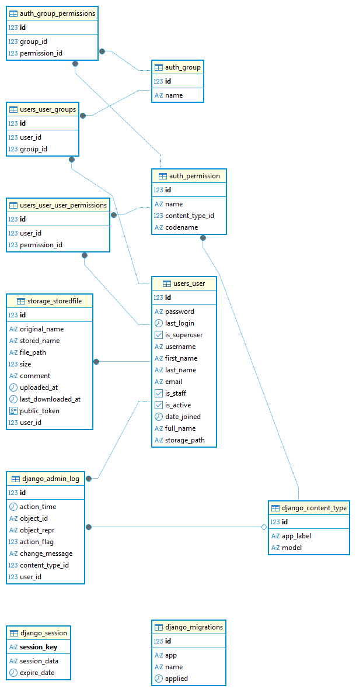

# 📦 MyCloud — облачное хранилище (Backend)

Backend часть дипломного проекта.  
Реализует REST API для хранения файлов пользователей.

## 🚀 Возможности

- Регистрация и авторизация пользователей
- Получение текущего пользователя
- Выход из системы
- Загрузка файлов
- Список файлов пользователя
- Удаление файлов
- Обновление комментария файла
- Скачивание файла
- Генерация публичной ссылки
- Скачивание файла по публичной ссылке
- Изменение никнейма и имени
- Изменение пароля
- Администрирование пользователей

---

## 🛠 Стек

- Python 3.13
- Django 6
- Django REST Framework
- PostgreSQL
- DBeaver (для просмотра БД)

## 📦 Зависимости

- asgiref==3.11.1
- Django==6.0.3
- django-cors-headers==4.9.0
- djangorestframework==3.16.1
- gunicorn==25.1.0
- packaging==26.0
- psycopg==3.3.3
- python-dotenv==1.2.2
- sqlparse==0.5.5
- tzdata==2025.3
- whitenoise==6.12.0

---

## ⚙️ Установка

### 1. Клонировать репозиторий

```
git clone <repo_url>
cd Backend
```

### 2. Создать виртуальное окружение

```
python -m venv venv
venv\Scripts\activate
```

### 3. Установить зависимости

```
pip install -r requirements.txt
```

---

## 🔐 Настройка окружения

Создать файл `.env` на основе `.env.example` :

```
SECRET_KEY=your_secret_key
DEBUG=True
ALLOWED_HOSTS=127.0.0.1,localhost

DB_NAME=mycloud
DB_USER=postgres
DB_PASSWORD=your_password
DB_HOST=localhost
DB_PORT=5432
```

---

## 🗄️ База данных

Создать БД в PostgreSQL:

```
CREATE DATABASE mycloud;
```



---

## 🔧 Миграции

```
python manage.py migrate
```

---

## 👤 Создание администратора

```
python manage.py createsuperuser
```

---

## ▶️ Запуск сервера

```
python manage.py runserver
```

---

## 📡 API

### 🔐 Аутентификация

- POST `/api/auth/register/` — регистрация
- POST `/api/auth/login/` — вход
- POST `/api/auth/logout/` — выход
- GET `/api/auth/me/` — текущий пользователь

---

### 👤 Users (admin)

- GET `/api/auth/users/` — список пользователей
- DELETE `/api/auth/users/{id}/` — удалить пользователя
- PATCH `/api/auth/users/{id}/` — изменить пользователя

---

### 📁 Файлы

- GET `/api/files/` — список файлов
- POST `/api/files/upload/` — загрузка файла
- DELETE `/api/files/<id>/delete/`— удалить файл
- PATCH `/api/files/<id>/` — обновить файл
- GET `/api/files/<id>/download/` — скачать файл

---

### 🌍 Публичный доступ

- POST `/api/files/<id>/public-link/`— получить ссылку
- GET `/api/files/public/<token>/`— скачать файл

---

## 📋 Примеры API запросов

### Регистрация пользователя

```json
POST /api/auth/register/
{
  "username": "testuser",
  "email": "123@gmail.com",
  "full_name": "Тестовый Пользователь",
  "password": "Password123!"
}
```

### Вход в систему

```json
POST /api/auth/login/
{
  "username": "testuser",
  "password": "Password123!"
}
```

---

## 📝 Логирование

Все действия логируются:

- регистрация
- вход/выход
- загрузка/удаление файлов
- скачивание
- генерация публичных ссылок
- изменение данных пользованеля

---

## 📌 Особенности

- аутентификация через сессии
- проверка прав доступа
- уникальные имена файлов
- поддержка публичных ссылок
- хранение файлов на сервере

---

## 📁 Структура проекта

```
backend/
├── config/
├── apps/
│   ├── users/
│   ├── storage/
│   └── core/
├── media/
├── static/
└── templates/
```

---

## 🗃️ Модели данных

### Пользователь (User)

- `username` — уникальное имя пользователя
- `full_name` — полное имя (опционально)
- `storage_path` — путь к хранилищу файлов (автоматически генерируется)

### Файл (StoredFile)

- `user` — владелец файла (ссылка на User)
- `original_name` — оригинальное имя файла
- `stored_name` — уникальное имя на диске
- `file_path` — полный путь к файлу
- `size` — размер в байтах
- `comment` — комментарий (опционально)
- `uploaded_at` — дата загрузки
- `last_downloaded_at` — дата последнего скачивания (опционально)
- `public_token` — токен для публичного доступа

---

## 🧪 Тестирование

Проект включает unit и integration тесты для основных функций.

### Запуск тестов

```
python manage.py test
```

### Запуск тестов для конкретного приложения

```
python manage.py test apps.users
python manage.py test apps.storage
```

### Покрытые функции

#### Аутентификация (apps/users/tests.py)

- **Регистрация пользователя**: Успешная регистрация и валидация данных
- **Вход в систему**: Успешный логин и обработка неверных данных
- **Доступ админа**: Проверка прав доступа к админ-функциям

#### Работа с файлами (apps/storage/tests.py)

- **Загрузка файла**: Успешная загрузка с проверкой сохранения в БД и на диск
- **Скачивание файла**: Успешное скачивание и обработка ошибок

## Тесты проверяют ключевые сценарии работы API и покрывают основной функционал приложения.

## ⚠️ Важно

- проект предназначен для учебных целей

---
